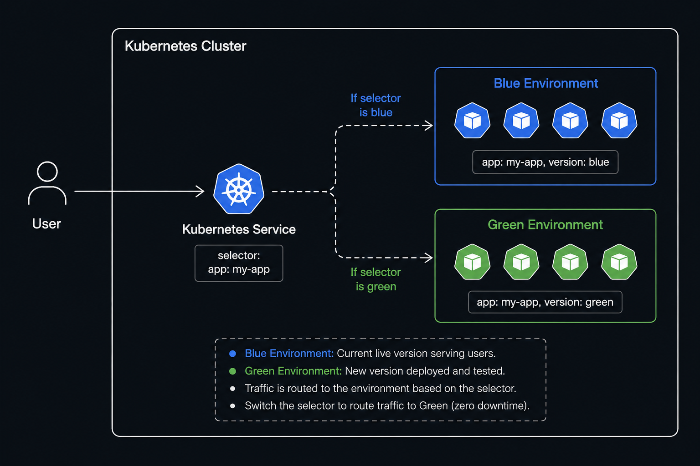
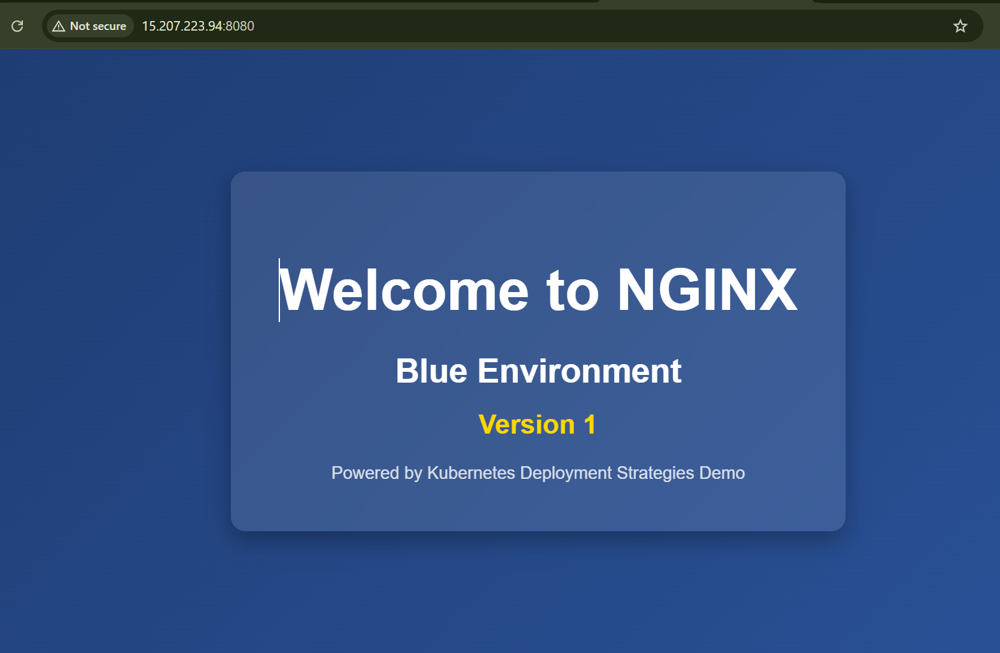

# Blue-Green Deployment Strategy
+ Blue-Green deployment is a strategy used in Kubernetes (and other environments) to reduce downtime and risk when deploying new versions of an application.
+ It involves maintaining two separate environments, which are referred to as Blue and Green.


#  How it works ?
+ Blue Environment: This is the live environment, where the current version of your application is running.
+ Green Environment: The new version of the application is deployed to the Green environment. During this phase, there is no impact on the users accessing the Blue environment.
+ Test the Green Environment: Once the Green environment is up, it is fully tested to ensure the new version works as expected.
+ Switch traffic: After validating that the Green environment is stable, the routing of user traffic is switched from Blue to Green. Now, the Green environment becomes the live production environment, and users interact with the new version.


| Pro's | Con's |
| ------------- | ------------- |
| Instant rollout/rollback | 	Requires double the resources  |
| Avoid versioning issue, change entire cluster state in one go | Proper test of entire platform should be done before releasing to the production environment. |


## NOTE:
> This deployment strategy is suitable for Production environment.




# Steps to implement Blue Green deployment

```bash
kubectl apply -f Blue-Deployment.yml
kubectl apply -f Green-Deployment.yml
kubectl apply -f Blue.Green-service.yml
```

+ Create Namespace
```bash
kubectl create ns bluegreen
```

+  Run the command to monitor the deployment & pods & service
```bash
kubectl get all -n bluegreen
````

+ It will deploy nginx web page (Blue environment) and apache web page (Green environment), now try to access the blue environment (nginx) web page on browser.

URL : `http://<EC2-PUBLIC-IP>:<nodeport>`



