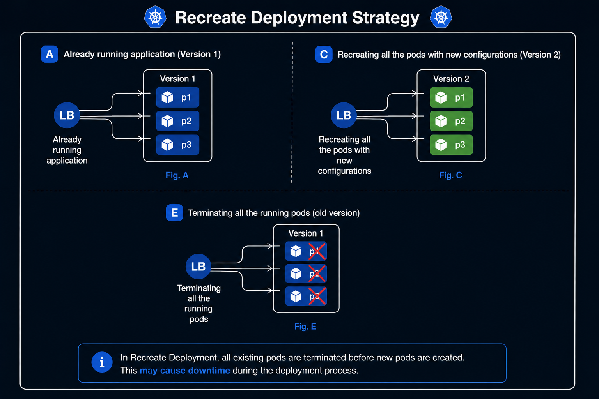
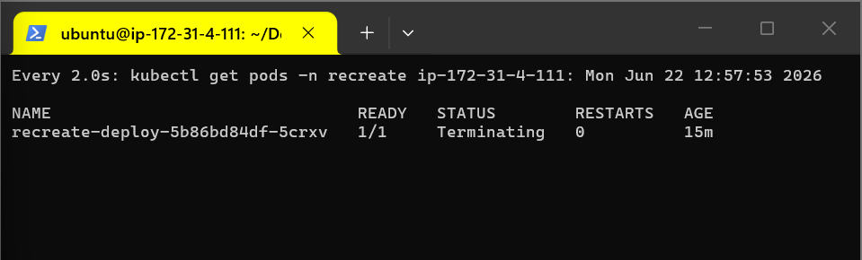
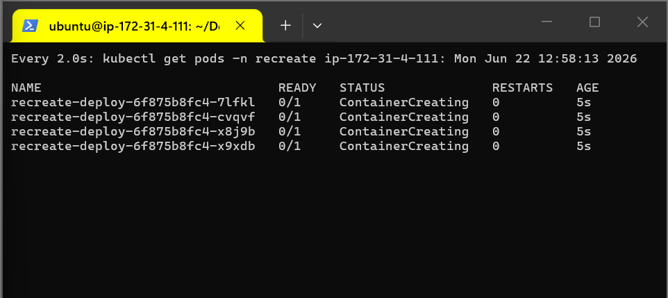

## Recreate Deployment Strategy
+ Recreate deployment strategy involves the process of terminating all existing running pods before creating new ones.

## How it works ?
+ Pod Termination: kubernetes terminates all existing pods.
+ Pod Creation: It creates new pods with updated configurations.

| Pro's                                 | Con's                                                                         |    
| ------                                | ---------                                                                     |
| Application state entirely renewed  | Downtime that depends on the both shutdown and boot duration of the application |

> # Note
> This deployment strategy is suitable for development environment.

Architecture Diagram:  
<p align="center">
 
</p>
---

# Steps to implement Recreate deployment

+ Create Namespace
```bash
kubectl create ns recreate
```

+ Apply the file present in the current directory with name recreate-deployment.yaml
```bash
kubectl  get all -n recreat
```

+ It will deploy nginx web page, now edit the deployment file and change the image from nginx to httpd and apply.

```bash
kubectl set image deployment/recreate-deployment nginx=httpd:latest -n recreate
```

+ terminates all existing pods.
<p align="center">
 
</p>

+ And Then It creates new pods with updated configurations.

<p align="center">
 
</p>

+  Check Immediately go to second tab where ran watch command and monitor 
