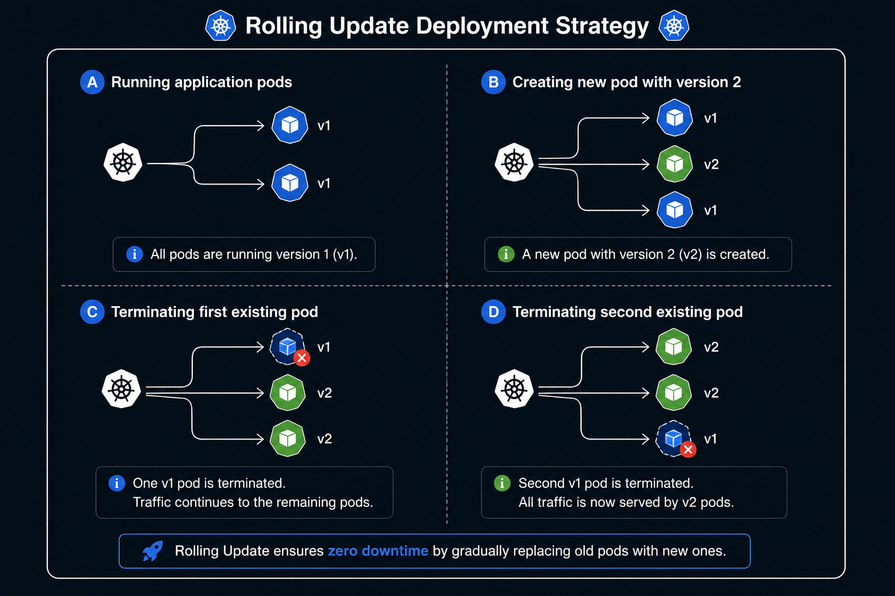
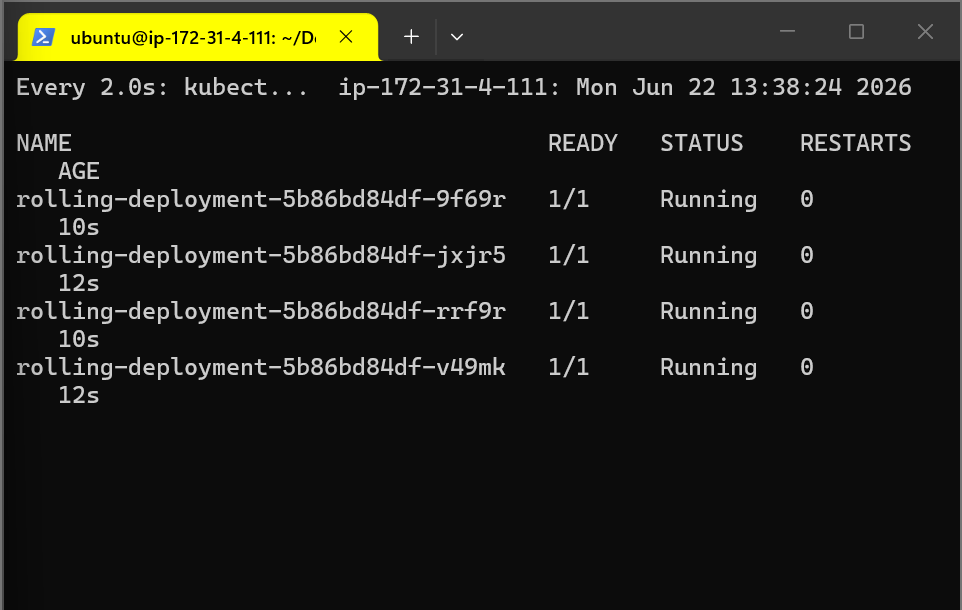
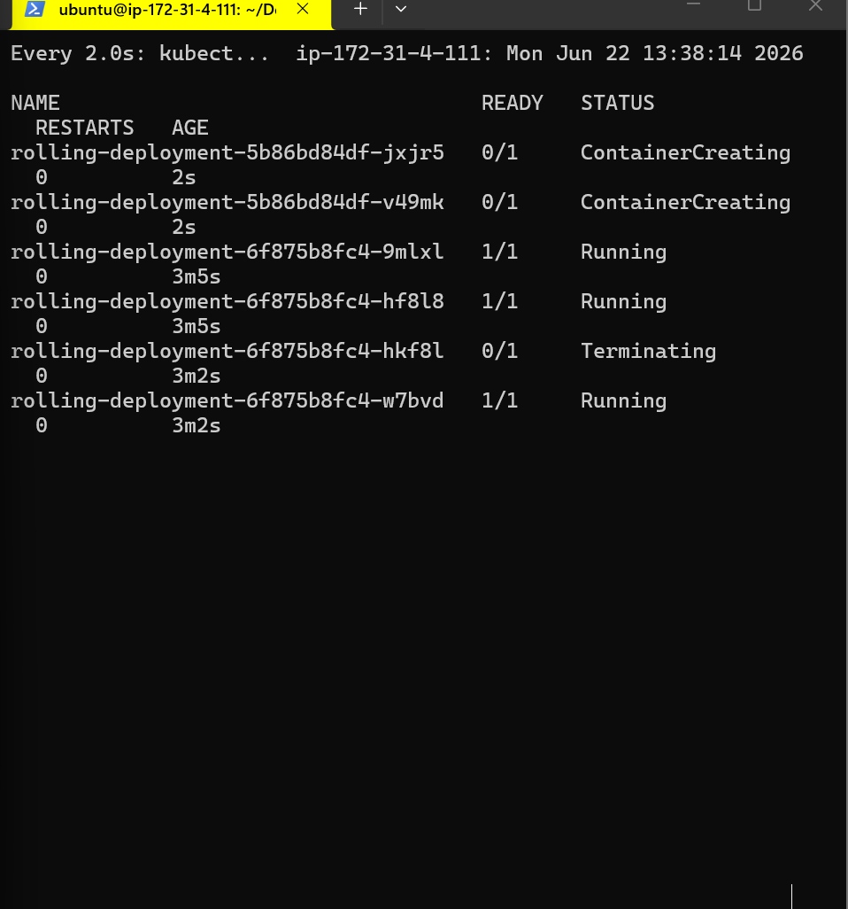

## Rolling Update Deployment Strategy
+ A rolling update in Kubernetes is a deployment strategy used to gradually replace the existing set of Pods with a new set of Pods one by one.
+ This ensures that there is no downtime during the update process as the application continues to serve requests while the update is in progress.

# How it works ?
+ Pod Creation: kubernetes creates one new pod of newer version.
+ Pod Termination: It terminates existing pods.


| Pro's | Con's |
| ------------- | ------------- |
| Version is slowly released across instances | Rollout/Rollback can take time  |
| Convenient for stateful applications | No control over traffic |

> # Note:
> This deployment strategy is suitable for UAT,QA environment. For stateful applications suitable on production environment


Architecture Diagram:  
<p align="center">
 />
</p>
---

# Steps to implement Recreate deployment

+ Create Namespace
```bash
kubectl create ns roling
```

+ Apply the file present in the current directory with name .yaml
```bash
kubectl apply -f rolling-deployment.yml
```

+  run the watch command to monitor the deployment
```bash
kubectl get pod -n rolling
```

<p align="center">
 />
</p>


+ It will deploy nginx web page, now edit the deployment file and change the image from nginx:latest to httpd:latest and apply again.

```bash
kubectl set image deployment/rolling-deployment nginx=httpd:latest -n rolling 
```

<p align="center">
 />
</p>
